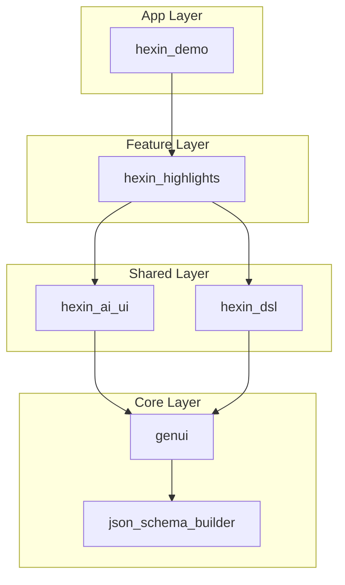

# Hexin Architecture & Dependencies

This document outlines the architecture and dependency relationships of the Hexin application suite (`hexin_demo`) and its modular packages.

## Dependency Graph

## Package Summary

### 1. `hexin_demo` (Application)
- **Role**: The main entry point application.
- **Responsibility**: Aggregates all features and provides the app shell (navigation, auth, config).
- **Dependencies**: Imports `hexin_highlights`, `hexin_ai_ui`, `hexin_dsl`, and `genui`.

### 2. `hexin_highlights` (Business Feature)
- **Role**: Implements the "Highlights" (看点) business feature.
- **Responsibility**: Fetching news/highlights data (`HighlightsService`), data models (`HighlightsResponse`), and the specific UI page (`HighlightsPage`).
- **Dependencies**:
    - `hexin_ai_ui`: For reusable UI cards.
    - `hexin_dsl`: For parsing Markdown/DSL content.
    - `genui`: For core GenUI types.

### 3. `hexin_ai_ui` (UI Component Library)
- **Role**: Reusable UI library.
- **Responsibility**: Provides domain-specific but "dumb" UI components (e.g., `StockQuote`, `AiMessage`, `MarketBreadthBar`) that can be used across different features.
- **Dependencies**: `genui`, `json_schema_builder`.

### 4. `hexin_dsl` (Protocol Layer)
- **Role**: DSL Parser & Renderer.
- **Responsibility**: Parsing the block-based DSL format from LLM responses and delegating rendering to the appropriate catalog.
- **Dependencies**: `genui`.

### 5. `genui` (Core Framework)
- **Role**: Foundation framework.
- **Responsibility**: Defines core interfaces (`ContentGenerator`, `GenUiConversation`), state management, and basic types.
- **Dependencies**: `json_schema_builder`.
