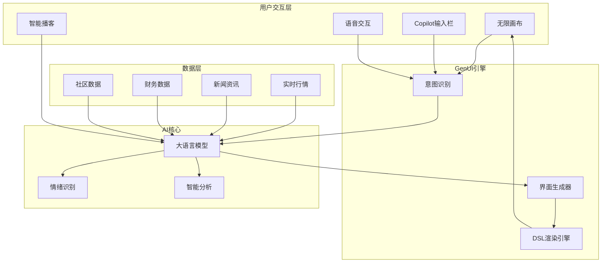

# 金融AI-App - Hexin Flow（同花顺·流）

> 基于A2UI生成式界面的AI原生交易终端，界面随意图实时生长，让每位用户拥有专属的无限画布式智能投顾体验。

---

## 一、产品核心定位

### 产品名称
**Hexin Flow（同花顺·流）**

### Slogan
> "没有固定界面的交易终端，App 随你的意图实时生长。"

### 核心理念
Hexin Flow 打破传统的"行情/交易/资讯"分离的Tab布局，采用**A2UI生成式界面**技术，构建以**意图流（Intent Stream）**为核心的无限交互画布。

- 🚫 不再依赖固定页面布局
- 🚫 不再需要多次跳转切换
- ✅ 所有信息与功能在无边界、实时响应的画布中完成
- ✅ 每位用户的界面基于即时需求动态生成

### 目标群体

| 群体 | 年龄 | 特征 | 痛点 |
|------|------|------|------|
| **Tech-savvy投资者** | 25-40岁 | 技术背景强，追求极致效率 | 功能堆砌、跳转繁琐 |
| **投资新手** | 18-30岁 | 0-1年经验，学习意愿强 | 不懂选股、信息过载 |
| **时间稀缺型** | 30-50岁 | 工作繁忙，无暇盯盘 | 需要智能监控和推送 |
| **价值投资者** | 35-55岁 | 追求长期稳定收益 | 需要深度分析支持 |

---

## 二、核心功能设计（5大模块）

### 模块一：🎨 无限画布首页 (The Infinite Canvas)

**核心创新**：打破传统Tab布局，一切内容在画布上动态生成

**页面结构**：
- **Living History 动态时间轴**：显示持仓突破、新闻解读、风控提醒、交易复盘
- **AI功能卡片区**：资金流热图、持仓诊断、智能选股、策略回测等
- **Copilot 输入栏**：常驻底部，输入意图即生成界面

**关键特性**：

- **Copilot 输入栏**：常驻底部，支持语音/文字，输入意图即生成界面
- **Living History**：个性化时间轴，基于持仓和关注动态生成
- **卡片生长系统**：功能卡片根据用户需求在画布上"生长"出来

---

### 模块二：📊 全息透视行情 (Holographic Vision)

**核心创新**：K线图不再只是数据，而是带有AI标注的"故事线"

**交互设计**：
- K线关键波动点显示AI标注（如"行业利空""主力-5亿"）
- 点击标注展开详细归因分析

**关键特性**：

- **K线事件标注**：AI自动标注关键波动点，点击展开归因分析
- **Server-Driven面板**：根据股票类型自动调整展示重点
  - 银行股 → 股息率、PB、不良率
  - 科技股 → 研发投入、行业增速
  - 周期股 → 供需数据、库存周期
- **多维度数据可视化**：资金流、筹码分布、情绪指标一屏可见

---

### 模块三：🛡️ 情绪风控官 (Emotion Guard)

**核心创新**：AI识别交易情绪，"软性阻断"冲动交易

**情绪识别多维度数据源**：
| 数据类型 | 采集方式 | 分析指标 |
|----------|----------|----------|
| 交易行为 | App内埋点 | 下单频率、撤单率、交易时长 |
| 生理信号 | 智能手环 | 心率变异、皮肤电导 |
| 交互模式 | UI行为 | 滑动速度、点击力度、停留时长 |

**干预层次**：

1. **轻度提醒**：弹窗提示当前情绪状态
2. **中度干预**：UI变灰+个性化建议
3. **强制冷静**：锁定交易15分钟（可设置）

---

### 模块四：🎙️ 多模态智能播客 (Smart Podcast)

**核心创新**：可打断的个性化语音播报

**使用场景**：
- 🚗 通勤路上听晨报
- 🏃 跑步时了解持仓动态
- 🛏️ 睡前听研报摘要

**播客内容（AI生成）**：

**关键特性**：

- **TTS语音合成**：研报/资讯自动转语音，类似于电台广播或者相声

- **可打断交互**：随时提问，AI暂停并插入分析

  

---

### 模块五：🎯 智能分析助手 (AI Copilot)

**整合功能**：持仓诊断 + 智能选股 + 资讯雷达

**持仓诊断卡片功能**：
- 📊 **风险评估**：行业集中度、最大回撒风险、贝塔系数
- 📈 **收益归因**：选股贡献、择时贡献、仓位贡献
- 💡 **AI建议**：个性化调仓建议
- **操作按钮**：一键优化组合、详细报告、分享

**智能选股对话示例**：
- 用户："帮我找估值低、业绩稳定、股息率高的标的"
- AI自动筛选：PE<15, 股息率>4%, ROE>12%
- 返回结果：中国神华、招商银行等符合条件的股票

---

## 三、技术架构

---

## 四、竞争优势

| 维度 | 传统炒股App | Hexin Flow |
|------|-------------|------------|
| **界面模式** | 固定Tab页面 | A2UI无限画布 |
| **交互方式** | 点击菜单层层跳转 | Copilot意图驱动 |
| **信息获取** | 用户主动搜索 | AI主动生成推送 |
| **情绪管理** | 无 | 情绪风控官+软性阻断 |
| **内容形式** | 图文为主 | 多模态：图文+语音+播客 |

---

## 五、商业价值

1. **技术壁垒**：A2UI生成式界面是核心技术护城河
2. **用户粘性**：个性化+情绪管理，预计DAU提升40%
3. **降低流失**：情绪风控减少亏损用户，流失率降低25%
4. **增值变现**：高级AI分析、策略订阅、社交会员
5. **数据飞轮**：用户行为 → 优化模型 → 更好体验 → 更多用户

---

# AI-App 特色功能设计

## 功能二：🩺 AI诊疗师 (Dr. Stock)

### 功能定位
基于交易记录分析投资人格MBTI，每日出具诊疗单阴阳复盘，让亏损变成段子，把教训变成疗愈。

### 核心设定

| 角色设定 | 说明 |
|----------|------|
| **人设** | 毒舌但有爱的"复盘医生"，所有韭菜在他眼里都"有病" |
| **语气** | 阴阳怪气 + 专业分析 + 偶尔暖心安慰 |
| **目标** | 用幽默化解焦虑，用专业帮助成长 |

---

### 核心功能设计

#### 1️⃣ 投资人格MBTI诊断

**投资人格MBTI（16种）**：
- **维度一 I/E**：独立研究型 vs 跟风社交型
- **维度二 S/N**：数据务实型 vs 直觉故事型
- **维度三 T/F**：理性纪律型 vs 情绪冲动型
- **维度四 J/P**：计划持有型 vs 灵活投机型

**人格类型示例**：
| 类型 | 名称 | 特征 | 医生点评 |
|------|------|------|----------|
| ISTJ | 价值老农 | 死拿不撒手 | "您这是把股票当祖产了" |
| ENFP | 追风少年 | 啥热买啥 | "建议您直接买热搜榜单ETF" |
| ESFP | 快乐韭皇 | 买就是为了快乐 | "钱没了是小事，开心最重要对吧？" |
| INTJ | 冷血收割 | 机械执行策略 | "您不考虑去做量化吗？" |

---

#### 2️⃣ 投资病历单

**病历单内容**：
- 📋 **基本信息**：患者韭菜先生，入市3年2个月
- 🎭 **投资人格**：ESFP 快乐韭皇（"追涨杀跌，但追得很快乐"）
- 📉 **主诉**：近30日亏损18%，但仍乐此不疲
- 🩺 **诊断**：追涨杀跌综合征（重度）、FOMO焦虑症（中度）、止损困难症（轻度）
- 💊 **医嘱**：强制冷静期15分钟、禁止看股吧、设置止损线8%

---

**诊疗单内容**：
- 📊 **今日战绩**：收益-2,847元(-1.23%)，买入2次卖出1次
- 🏥 **诊疗评分**：操作健康度 38分（追涨-20分、频繁换手-15分、有设止损+10分）
- ⚡️ **医生阴阳区**："中午12:58追涨买入比亚迪，下午14:30跌了2%您就慌了？建议您以后吃完午饭先睡个午觉..."
- 💗 **暖心安慰**："至少您今天设了止损，进步了"

---

#### 3️⃣ 阴阳话术库

| 场景 | 阴阳话术示例 |
|------|--------------|
| **追涨买入** | "12:58分买入？您是等资金都进去了才发现的吧" |
| **杀跌卖出** | "建议您以后跌的时候把手机锁起来" |
| **频繁换手** | "您这换手率，券商都要给您发锦旗了" |
| **小赚就跑** | "赚3%就跑，亏30%死扛，教科书级别的操作" |
| **买在高点** | "恭喜您精准买在历史最高点，这也是一种天赋" |

**暖心安慰库**（亏太狠时触发）：
| 触发条件 | 安慰话术 |
|----------|----------|
| 单日亏损>5% | "今天确实难熬，但市场总有周期，歇一歇没关系" |
| 连续亏损3天 | "连续下跌不代表永远下跌，给自己放个假吧" |

---

#### 4️⃣ 成长档案

**成长档案内容**：
- 📈 **健康度趋势**：Jan 42分 → Feb 58分 → Mar 75分
- 🏆 **成就解锁**：连续7天不追涨✅、首次严格执行止损✅
- 💬 **医生寄语**："虽然还是个韭菜，但已经是根有觉悟的韭菜了"

---

### 产品设计图

